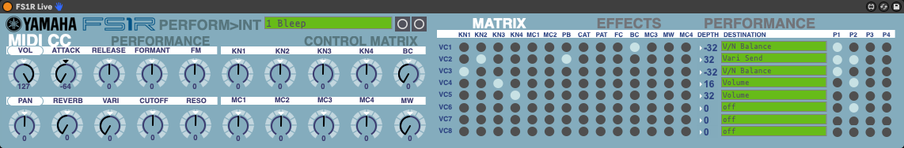
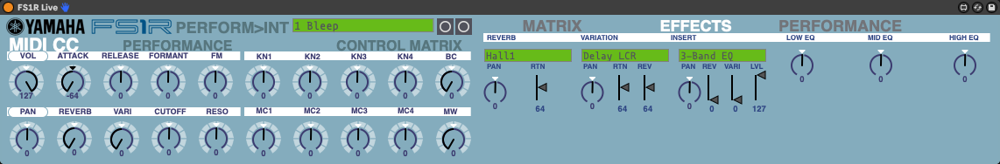

# FS1R Live
\
A Max for Live Device for controlling a Yamaha FS1R Performance.  Uses sysex to sync device parameters.  Basically my goal is to me able to use my FS1R in Albeton and make my patch edits there instead of having a separate app open. Still a ways to go, but still very useful in it's current state.

## SETUP
### FS1R
Your FS1R should be in Performance Play mode in the Internal Bank and make sure this you have this setting :
 `UTIL -> SYSTEM -> MIDI -> RcvBulkDump=off`
### Ableton Live
MIDI Track with External Instrument Device
### Program
Currently the Program Menu is hardcoded in the menu device.  It matches my Internal Bank, you can change it by editing the menu. Just swap out your names, but be sure each name has quotes. Even with the wrong names is still usable however, as it just sends a Program Change number so you can select your performace with this. 
### Sysex
You can receive parameters from the FS1R after selecting a program.\
\
1st make sure your midi is routed correctly on the track (make sure to switch the monitor back to AUTO after) and then click the button to the right of the Program Name (`GET PERFORMANCE`).  Your GUI should update. Go back to Auto when it's loaded.

## USAGE
\
### MIDI CC
#### Permormance
This section contains the default MIDI CC avaiable for the Performance.  These work on the Performance Part 1.
#### Control Matrix
This section contains the assignable controlers.  You can see what is being controled (as well as change it) in the Control Matrix section
### MATRIX EFFECTS PERFORMANCE tab
#### MATRIX
Matrix allows full visibilty and editing of your Control Matrix.  `GET PERFORMANCE` will populate this area, and any changes made will be sent immediately via sysex.  Note you will have to store the patch directly on your F1SR for now.
#### EFFECTS
Just started this section.  Currently you can control the type and basic (shared) parameters for all 3 effects.  Designing a dynamic UI for the different parameters in each effect type will take a little time, so I will probably tackle the EQ (currently disabled) section next.
#### PERFORMANCE
To come...