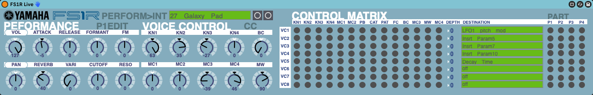
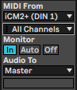

# FS1Rlive

A Max for Live Device for controlling a Yamaha FS1R Performance.  Uses sysex to sync device parameters.

## SETUP
### FS1R
Your FS1R should be in Performance Play mode in the Internal Bank.  UTIL -> SYSTEM -> MIDI -> RcvBulkDump=off
### Ableton Live
MIDI Track with External Instrument Device

## USAGE
### Program
Currently the Program Menu is hardcoded in the menu device.  It matches my Internal Bank, you can change it by editing the menu. It is still usable however, it sends a Program Change so you can select your performace with this. 
### Sysex
You can receive parameters from the FS1R after selecting a program.\
\
1st make sure your midi is routed correctly on the track (make sure to switch the monitor back to AUTO after) and then click the button to the right of the Program Name.  Your GUI should update.

### Control
For now the Performance and Voice Control sections are active.  The Control Matrix recieves and displays program data so you know where the KNOBs and MCs are mapped, but currently does not support sending the data so editing this section will do absolutely nothing on the FS1R

More to come...